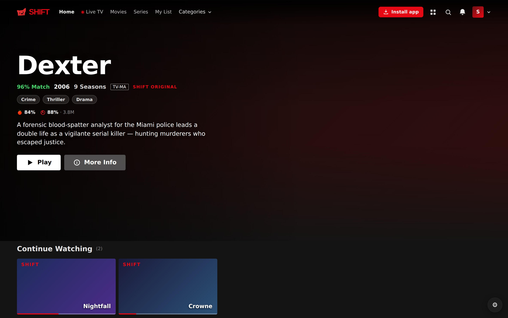
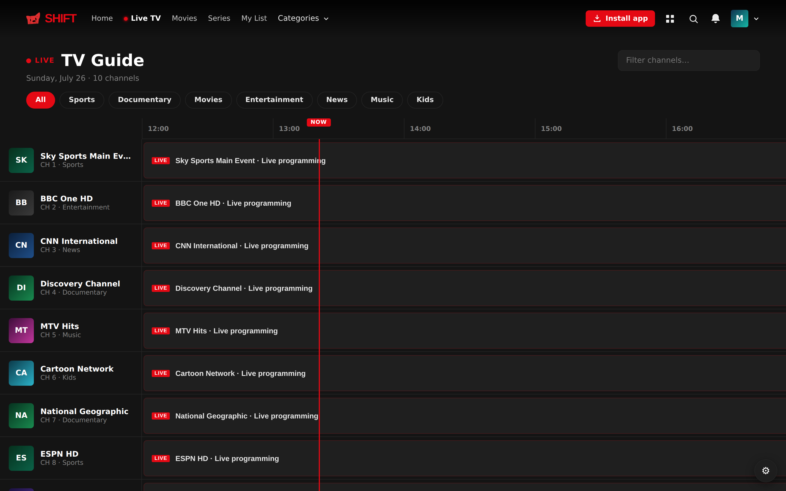
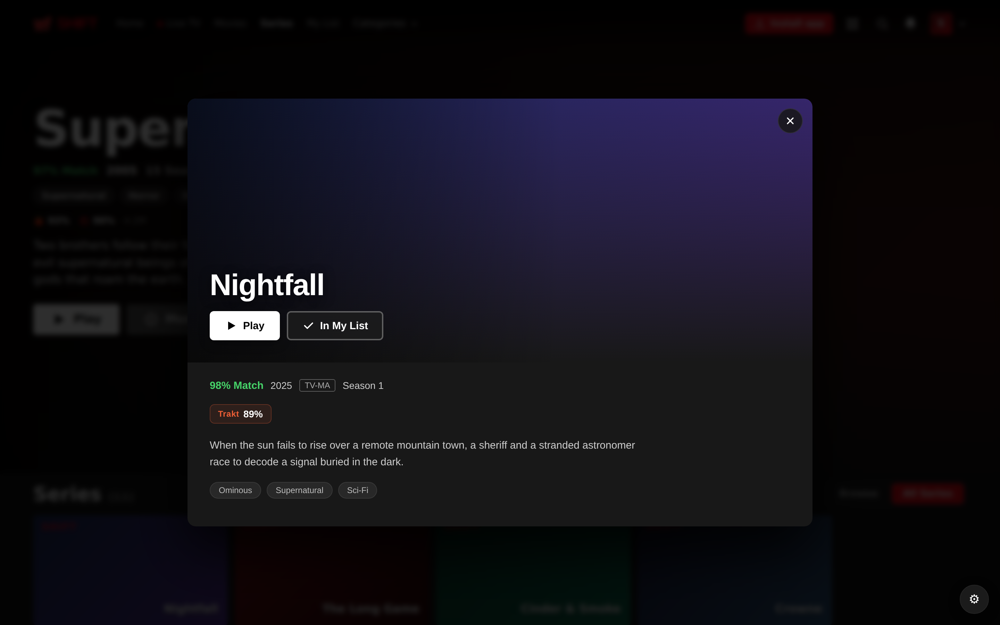
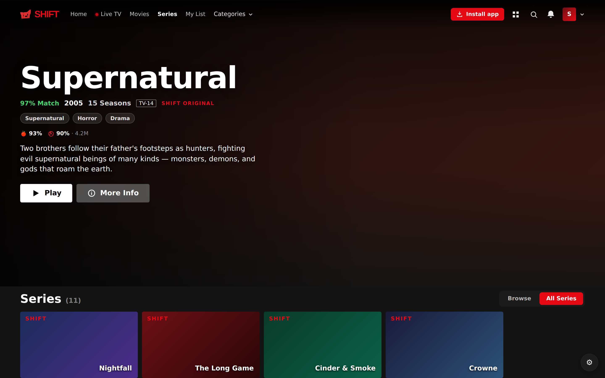
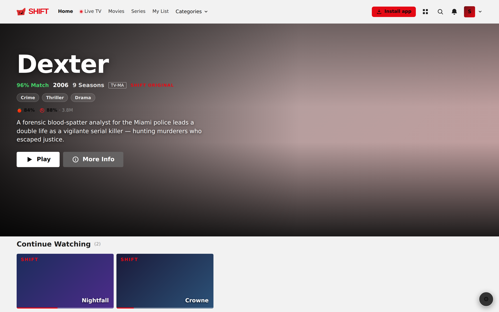

<div align="center">
  
  <h1>SHIFT</h1>
  <p><strong>A Netflix-style IPTV player.</strong> Bring your own provider — stream live TV, movies and series in a player that finally looks the part.</p>
  <p>
    <a href="https://shift-iptv.vercel.app"><strong>▶ Live demo — shift-iptv.vercel.app</strong></a>
  </p>
</div>

---

SHIFT connects to your own **Xtream Codes** or **M3U** IPTV provider and gives it a clean, modern interface: a hero billboard, a full TV guide, subtitles, picture-in-picture, and cross-device resume. No content is included — you bring your own provider credentials.

> **Legal:** SHIFT is a media *player*, like VLC. It ships with zero channels or media. You supply your own IPTV subscription. What you stream is your responsibility.

## 📸 Screenshots

<p align="center">
  <br/>
  <em>Home — billboard hero, Continue Watching, genre rails</em>
</p>

<p align="center">
  <br/>
  <em>Live TV — full EPG grid with category filters and a live "NOW" marker</em>
</p>

<p align="center">
  <br/>
  <em>Title details — ratings, synopsis, My List</em>
</p>

<table>
  <tr>
    <td width="50%"><br/><em align="center">Series — full catalogue grid</em></td>
    <td width="50%"><br/><em>Light theme</em></td>
  </tr>
</table>

## ✨ Features

- **Live TV + EPG** — thousands of channels with a real programme guide (fetched from your provider's XMLTV feed), live-now channels sorted to the top
- **Movies & Series** — your whole VOD catalogue, organised into genre rails, with a billboard hero
- **Real cover art** — pulls widescreen backdrops from **TMDB** when your provider only has a poster
- **Subtitles** — OpenSubtitles + keyless sources, auto-matched, and visible in Picture-in-Picture
- **Picture-in-Picture** & fill/fit aspect controls
- **Cross-device resume** — continue watching syncs across devices via Supabase, and via **Trakt** across other Trakt-connected apps (e.g. UHF)
- **Fast seeking** — aggressive HLS buffering so scrubbing within the buffer is instant
- **Light & dark themes**, custom accent colours, and **Shifty** the cat mascot 🐱

## 🧱 Tech stack

| | |
|---|---|
| **Web** | React + TypeScript + Vite, [hls.js](https://github.com/video-dev/hls.js), zustand |
| **Streaming proxy** | Vercel serverless functions (`/api`) — CORS, HTTP→HTTPS, Range-preserving redirects, m3u8 rewriting |
| **Sync** | Supabase (watch progress) + Trakt.tv (cross-app scrobbling) |
| **Art / metadata** | TMDB, Cinemeta, OMDb, Trakt |
| **Desktop** | Electron + native **mpv** (plays MKV/HEVC/AV1), and a lightweight Tauri shell |
| **Mobile** | Expo / React Native (`expo-video`) |

## 📁 Project layout

```
src/            Web app (React)
api/            Vercel serverless functions (stream proxy, Trakt token, subtitles)
public/         PWA manifest, icons, service worker
desktop/        Electron + mpv build (plays everything — MKV/HEVC)
desktop-tauri/  Tauri v2 shell (lightweight; HLS/MP4 via WebView2)
mobile/         Expo / React Native app (see the claude/mobile-app-ios branch)
transcoder/     Optional transcode helper
```

## 🚀 Run it locally (web)

```bash
npm install
npm run dev        # http://localhost:5173
```

Then open the app, choose **Xtream Codes** or **M3U**, and enter your provider details.

Build for production:
```bash
npm run build      # → dist/
```

### Deploy
The app is built for **Vercel** (the `/api` proxy needs a serverless runtime). Push to a Vercel-connected repo, or `vercel deploy`. Set optional env vars:

| Variable | Purpose |
|---|---|
| `TRAKT_CLIENT_SECRET` | Enables Trakt sign-in server-side (optional — users can also paste their own) |

## 🖥️ Desktop builds

**Electron + mpv** (plays MKV / HEVC / AV1 — recommended):
```bash
cd desktop
npm install
npm run get-mpv    # downloads mpv into bin/
npm run dist       # → installer .exe
```

**Tauri** (tiny ~5-10 MB shell; HLS/MP4 only — no MKV):
```bash
cd desktop-tauri
npm install && npm run icons && npm run build   # → MSI + NSIS installer (build on Windows)
```

## 📱 Mobile (Expo)

On the `claude/mobile-app-ios` branch:
```bash
cd mobile
npm install
npx expo start     # scan the QR with Expo Go
```

## 🔑 Optional integrations

Configure these in **Settings → Integrations**:
- **TMDB** — widescreen billboard/cover art *(free API key)*
- **OpenSubtitles** — larger subtitle quota with your account *(subtitles work keyless too)*
- **Trakt** — scrobbling + cross-app continue-watching

## License

Personal project. Not affiliated with any IPTV provider, Netflix, TMDB, Trakt, or OpenSubtitles.

<div align="center"><sub>Built with 🐱 by Shifty.</sub></div>
